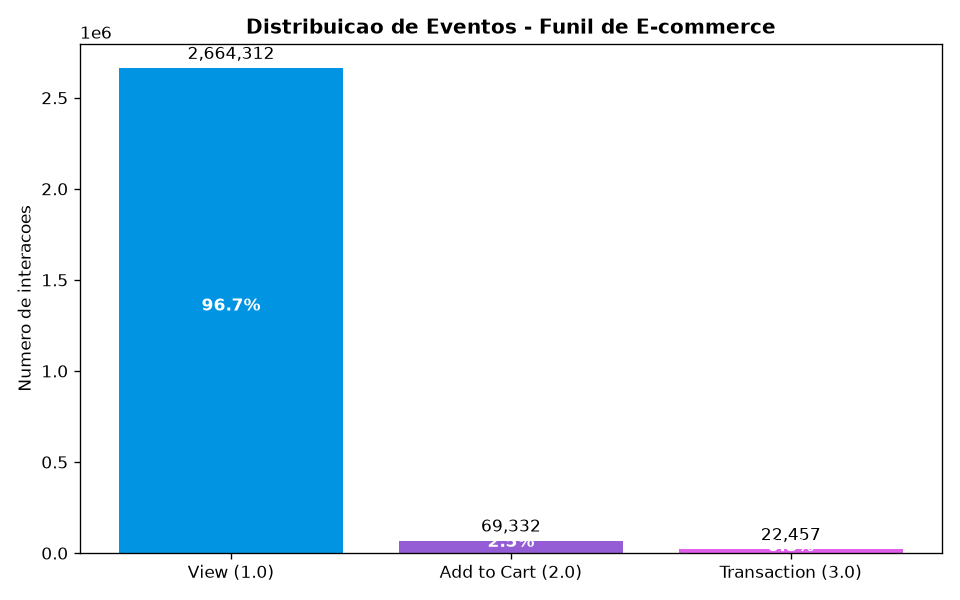
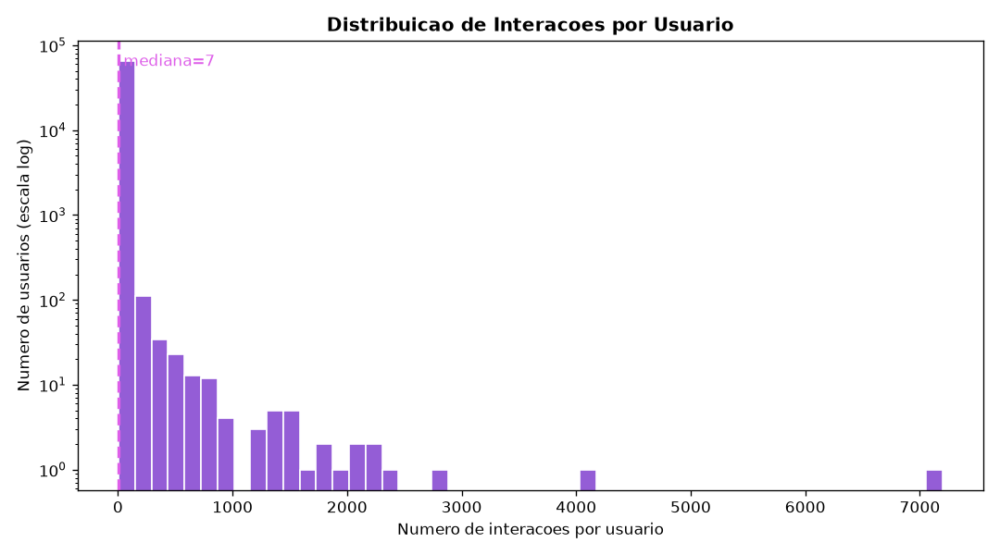
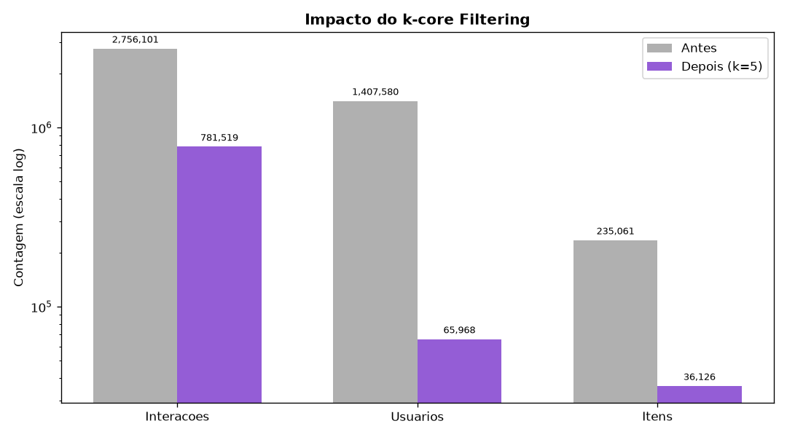
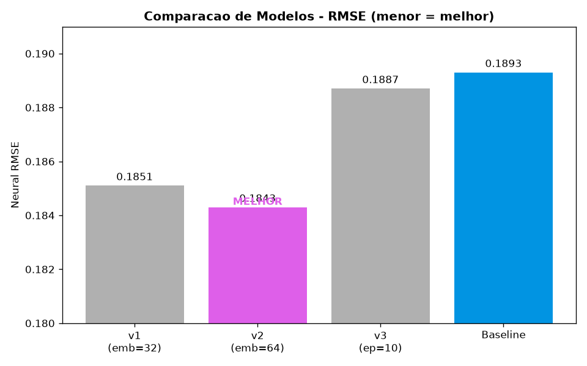

# Recomendador E-commerce

> Sistema de recomendacao de produtos para e-commerce baseado em rede neural (PyTorch), construido com praticas profissionais de MLOps -- clean code, ambiente reproduzivel, dados versionados, pipeline automatizado, containerizacao e rastreamento de experimentos.


---

## Autor

**Henrique Silva** -- Data Scientist | ML Engineer

[](https://www.linkedin.com/in/henrique-silva-ds)
[](https://github.com/Henry3151)

Pos-graduacao em Machine Learning Engineering -- FIAP + Alura (PosTech)

---

## Visao geral

Este projeto entrega um recomendador de produtos treinado sobre dados reais de comportamento de e-commerce (RetailRocket). O foco nao esta apenas no modelo, mas em transformar Machine Learning de "experimento em notebook" para **software profissional reproduzivel e versionado** -- o pilar de MLOps.

| Dimensao | Ferramenta | O que garante |
|----------|-----------|---------------|
| Codigo limpo | ruff + design patterns | Legibilidade e manutencao |
| Ambiente | uv + lock file | Reprodutibilidade de dependencias |
| Dados | DVC | Versionamento de datasets grandes |
| Pipeline | dvc.yaml | Execucao reproduzivel com rebuild seletivo |
| Execucao | Docker multi-stage | Roda igual em qualquer maquina |
| Experimentos | MLflow | Rastreamento e governanca de modelos |

---

## O problema

Um e-commerce com milhoes de eventos de navegacao precisa sugerir produtos relevantes para cada usuario. Mas os dados reais trazem desafios que um modelo ingenuo nao resolve.

| Desafio | Solucao |
|---------|---------|
| 2,7 milhoes de eventos, maioria ruido (1-2 cliques) | k-core filtering iterativo (reducao de 71,6%) |
| Sinais implicitos (view/cart/buy) sem nota explicita | Traducao para escala de interesse (1.0 / 2.0 / 3.0) |
| IDs esparsos ate 1,4 milhao | Reindexacao para indices contiguos (embeddings PyTorch) |
| "Na minha maquina funciona" | Ambiente uv + Docker + dados DVC |
| Escolher o melhor modelo sem vies | 3 experimentos rastreados + promocao automatica por RMSE |

---


### Analise exploratoria dos dados

O funil de e-commerce revela o desafio central: a esmagadora maioria das interacoes sao visualizacoes, com pouquissimas compras.



A distribuicao de interacoes por usuario mostra a "cauda longa" -- a maioria dos usuarios interage com pouquissimos itens, justificando o k-core filtering.



---

## Pipeline

```
events.csv (RetailRocket, 2.7M eventos)
        |
        v
[ loader ]  view/addtocart/transaction -> rating 1.0/2.0/3.0
        |
        v
[ prepare ]  k-core (k=5) -> amostragem -> normalizacao -> reindexacao
        |
        v
interactions.parquet (172k interacoes densas)
        |
        v
[ train ]  NeuralRecommender (embeddings + MLP)  vs  MeanBaseline
        |
        v
MLflow: params + metrics + modelo registrado
        |
        v
[ promote ]  melhor RMSE -> alias "production"
```

Todo o fluxo `prepare -> train` e orquestrado pelo DVC e reproduzivel com um unico comando: `dvc repro`.

---


### Impacto do k-core filtering

O filtro remove usuarios e itens raros, reduzindo o ruido em 71,6% e preservando as interacoes densas.



---

## Arquitetura

Estrutura com responsabilidade unica por modulo (principio SOLID) e design patterns aplicados.

```
recomendador-ecommerce/
+-- src/recomendador/
|   +-- data/
|   |   +-- loader.py            # traducao RetailRocket -> contrato interno
|   |   +-- prepare.py           # estagio 1 do pipeline DVC
|   +-- preprocessing/
|   |   +-- preprocessors.py     # Strategy pattern (normalizacao)
|   |   +-- pipeline.py          # k-core iterativo + reindexacao
|   +-- models/
|   |   +-- base.py              # interface BaseRecommender
|   |   +-- factory.py           # Factory pattern (criacao de modelos)
|   |   +-- neural.py            # rede neural (embeddings + MLP)
|   |   +-- baseline.py          # baseline (media global)
|   +-- training/
|   |   +-- train.py             # estagio 2: treino + MLflow
|   |   +-- promote_model.py     # governanca: promocao a producao
|   +-- evaluation/
|   |   +-- metrics.py           # RMSE, MAE
|   +-- config.py                # configuracao central (Pydantic)
+-- scripts/
|   +-- validate_env.py          # diagnostico de ambiente
+-- data/
|   +-- raw/                     # dataset bruto (versionado por DVC)
|   +-- processed/               # interactions.parquet (saida do prepare)
+-- tests/
+-- dvc.yaml                     # definicao do pipeline reproduzivel
+-- Dockerfile                   # multi-stage build (PyTorch CPU)
+-- pyproject.toml               # dependencias + config ruff
+-- uv.lock                      # versoes exatas (reprodutibilidade)
```

### Design patterns

- **Strategy** (`preprocessors.py`) -- troca a estrategia de normalizacao (min-max, binaria) sem alterar o treino.
- **Factory** (`factory.py`) -- centraliza a criacao de modelos; adicionar um novo modelo nao muda o codigo cliente.

---

## O modelo

Rede neural baseada em **embeddings**: cada usuario e cada item viram um vetor aprendido de 32 (ou 64) dimensoes. A afinidade e estimada concatenando os vetores e passando por uma pequena MLP.

```
user_id --> [ user embedding (N x d) ] --+
                                          +--> concat --> Linear(2d->64) --> ReLU --> Linear(64->1) --> score
item_id --> [ item embedding (M x d) ] --+
```

Comparado a um **baseline** (media global) via scikit-learn -- se o modelo neural nao superar o baseline, nao ha aprendizado real.

---

## Resultados

Tres experimentos rastreados no MLflow, variando hiperparametros:

| Versao | embedding_dim | epochs | Neural RMSE | Neural MAE |
|--------|--------------|--------|-------------|------------|
| v1 | 32 | 5 | 0.1851 | 0.1017 |
| **v2 (producao)** | **64** | **5** | **0.1843** | **0.101** |
| v3 | 32 | 10 | 0.1887 | 0.104 |
| Baseline (media) | -- | -- | 0.1893 | 0.0986 |




> A versao 2 (embedding maior) obteve o menor RMSE e foi promovida automaticamente a producao. Aumentar epocas (v3) piorou o resultado -- indicativo de leve overfitting.

**Nota sobre o dominio:** 96,7% das interacoes sao visualizacoes (view), tornando o sinal fraco e o baseline forte. O modelo supera o baseline no RMSE, confirmando que aprende alem da media. Um refino natural seria tratar o problema como ranking implicito.

---

## Compatibilidade

| Sistema | Suporte | Ativacao do ambiente virtual |
|---------|---------|------------------------------|
| Windows | Sim | `.venv\Scripts\Activate.ps1` |
| Linux | Sim | `source .venv/bin/activate` |
| macOS | Sim | `source .venv/bin/activate` |

---

## Como executar

### Pre-requisitos

- Python 3.11 ou 3.12
- [uv](https://docs.astral.sh/uv/) (gerenciador de dependencias)
- Docker (opcional, para execucao containerizada)

### 1. Instalar dependencias

```bash
uv sync
```

Isso cria o ambiente `.venv` com as versoes exatas do `uv.lock`.

### 2. Validar o ambiente

```bash
uv run python scripts/validate_env.py
```

### 3. Obter o dataset

Baixe o dataset RetailRocket (arquivo `events.csv`) e coloque em `data/raw/events.csv`:

- Fonte: [RetailRocket E-commerce Dataset (Kaggle)](https://www.kaggle.com/datasets/retailrocket/ecommerce-dataset)

Coloque o `events.csv` sob controle do DVC:

```bash
uv run dvc add data/raw/events.csv
```

### 4. Rodar o pipeline reproduzivel

```bash
uv run dvc repro
```

Executa `prepare` (processa os dados) e `train` (treina + registra no MLflow). Rodar de novo sem mudancas: o DVC pula estagios inalterados (rebuild seletivo).

### 5. Visualizar experimentos

```bash
uv run mlflow ui
```

Abra `http://127.0.0.1:5000` no navegador.

### 6. Promover o melhor modelo a producao

```bash
uv run python -m recomendador.training.promote_model
```

### 7. Rodar com Docker

```bash
docker build -t recomendador-ecommerce .
docker run --rm -v "${PWD}/data:/app/data" recomendador-ecommerce
```

---

## O que este projeto demonstra

- **Clean code aplicado a ML** -- design patterns (Strategy, Factory), type hints, docstrings Google style, linting automatizado com ruff
- **Reprodutibilidade de ambiente** -- uv + lock file com versoes exatas, separacao prod/dev
- **Versionamento de dados com DVC** -- dataset de 94 MB rastreado por um ponteiro de 99 bytes (content-addressable storage)
- **Pipeline reproduzivel** -- `dvc.yaml` com estagios encadeados e rebuild seletivo
- **Tratamento de esparsidade** -- k-core filtering iterativo (reducao de 71,6% do ruido)
- **Traducao de sinais implicitos** -- eventos de navegacao convertidos em escala de interesse
- **Rede neural com embeddings** -- nucleo dos recomendadores modernos, em PyTorch
- **Comparacao com baseline** -- validacao real de aprendizado via scikit-learn
- **Containerizacao profissional** -- Docker multi-stage, PyTorch CPU, usuario nao-root (imagem 7x menor)
- **Rastreamento de experimentos** -- 3+ runs no MLflow com parametros e metricas
- **Governanca de modelos** -- Model Registry com promocao automatica a producao por metrica
- **Historico de commits semantico** -- Conventional Commits em toda a evolucao do projeto
- **Cross-platform** -- Windows, Linux e macOS

---

## Stack tecnologico

| Categoria | Tecnologias |
|-----------|-------------|
| ML / DL | PyTorch (embeddings + MLP), scikit-learn (baseline, metricas) |
| MLOps | MLflow (tracking + registry), DVC (dados + pipeline) |
| Ambiente | uv, pyproject.toml, Pydantic Settings |
| Infra | Docker multi-stage (PyTorch CPU) |
| Qualidade | ruff (lint + format), pytest |
| Dados | pandas, pyarrow (parquet) |
| OS | Windows, Linux, macOS |

---

## Contato

**Henrique Silva**

[](https://www.linkedin.com/in/henrique-silva-ds)
[](https://github.com/Henry3151)

---

## Referencias

- Koren, Y., Bell, R. & Volinsky, C. (2009). *Matrix Factorization Techniques for Recommender Systems*. IEEE Computer.
- He, X. et al. (2017). *Neural Collaborative Filtering*. WWW.
- Dataset: [RetailRocket E-commerce Dataset](https://www.kaggle.com/datasets/retailrocket/ecommerce-dataset)
